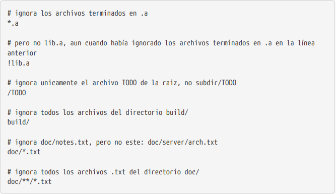

# Ignorando Archivos

A veces, tendrás algún tipo de archivo que no quieres que Git añada automáticamente o más aun, que ni siquiera quieras que aparezca como no rastreado. 

Este suele ser el caso de archivos generados automáticamente como trazas o archivos creados por tu sistema de compilación. 

En estos casos, puedes crear un archivo llamado .gitignore que liste patrones a considerar. 

Las reglas sobre los patrones que puedes incluir en el archivo .gitignore son las siguientes:

- Ignorar las líneas en blanco y aquellas que comiencen con #.
- Aceptar patrones glob estándar.
- Los patrones pueden terminar en barra (/) para especificar un directorio.
- Los patrones pueden negarse si se añade al principio el signo de exclamación (!).

Los patrones glob son una especie de expresión regular simplificada usada por los terminales. 

Un asterisco (*) corresponde a cero o más caracteres; [abc] corresponde a cualquier caracter dentro de los corchetes (en este caso a, b o c); el signo de interrogación (?) corresponde a un caracter cualquiera; y los corchetes sobre caracteres separados por un guión ([0-9]) corresponde a cualquier caracter entre ellos (en este caso del 0 al 9). 

También puedes usar dos asteriscos para indicar directorios anidados; a/**/z coincide con a/z, a/b/z, a/b/c/z, etc.

