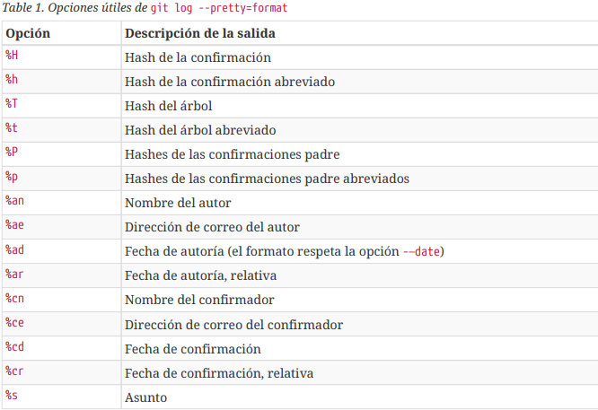
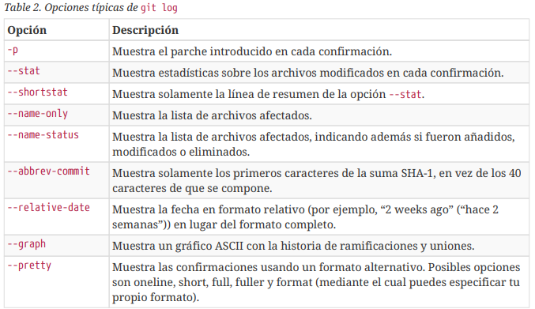
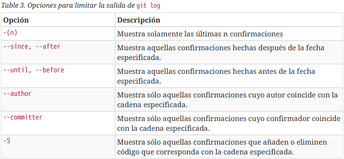

# Historial de confirmaciones

Después de haber hecho varias confirmaciones, o si has clonado un repositorio que ya tenía un histórico de confirmaciones, probablemente quieras mirar atrás para ver qué modificaciones se han llevado a cabo. La herramienta más básica y potente para hacer esto es el comando __git log__.

Por defecto, si no pasas ningún parámetro, __git log__ lista las confirmaciones hechas sobre ese repositorio en orden cronológico inverso. Es decir, las confirmaciones más recientes se muestran al
principio. 

```
git log -p (Nos muestra los cambios introducidos en cada confirmación)
git log -2 (Nos muestra las 2 últimas entradas del historial)
git log -stat (Imprime tras cada confirmación una lista de archivos modificados, indicando cuantas lineas han sido añadidas y eliminadas)
git log --pretty (Modifica el formato de salida)
git log --pretty=oneline (Imprime cada confirmación en una única línea, otras opciones son short, full y fuller)
```

La opción más interesante es format, que te permite especificar tu propio formato. Esto resulta especialmente útil si estás generando una salida para que sea analizada por otro programa —como especificas el formato explícitamente, sabes que no cambiará en futuras actualizaciones de Git.

```
$ git log --pretty=format:"%h - %an, %ar : %s"
```



Las opciones oneline y format son especialmente útiles combinadas con otra opción llamada --graph. 

```
$ git log --pretty=format:"%h %s" --graph
```



## Limitar la salida del Historial

Las opciones temporales como --since (desde) y --until (hasta) sí que resultan muy útiles.

```
$ git log --since=2.weeks
```

También puedes filtrar la lista para que muestre sólo aquellas confirmaciones que cumplen ciertos criterios. La opción --author te permite filtrar por autor, y --grep te permite buscar palabras clave
entre los mensajes de confirmación. (Ten en cuenta que si quieres aplicar ambas opciones simultáneamente, tienes que añadir --all-match, o el comando mostrará las confirmaciones que cumplan cualquiera de las dos, no necesariamente las dos a la vez.)

Otra opción útil es -S, la cual recibe una cadena y solo muestra las confirmaciones que cambiaron el código añadiendo o eliminando la cadena.

```
$ git log -Sfunction_name
```

