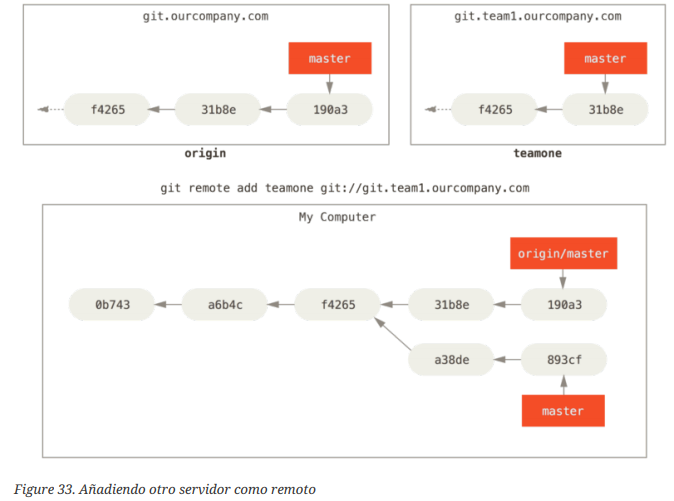

# Ramas Remotas

```
$ git fetch origin
```

Este comando localiza en qué servidor está el origen, recupera cualquier dato presente allí que tú no tengas, y actualiza tu base de datos local, moviendo tu rama origin/master para que apunte a la posición más reciente.

```
$ git remote add [nombre]
```

Este comando incluye como una nueva referencia remota a tu proyecto actual.



Para eliminar una rama remota

```
$ git push [nombreRemoto] --delete [nombreRama]
```