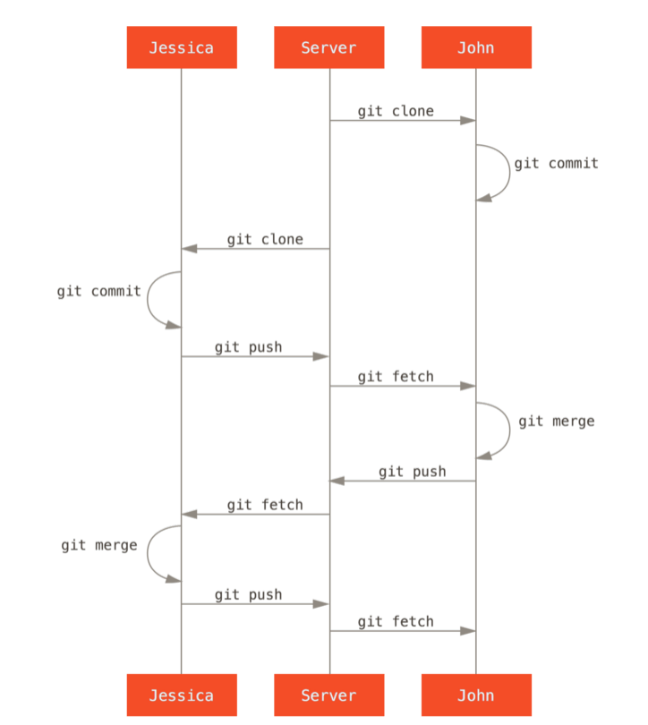

# Contribuyebdo a un proyecto

## Pautas de confirmación

En primer lugar, no desea enviar ningún error de espacios en blanco.
Para identificar posibles errores de espacio en blanco:

```
$ git diff --check
```

A continuación, intente hacer de cada commit un conjunto de cambios lógicamente separado. 

Si puede, trate de hacer que sus cambios sean digeribles: no codifique durante un fin de semana entero en cinco asuntos diferentes para luego envíarlos todos como un compromiso masivo el lunes.

Si algunos de los cambios modifican el mismo archivo:

```
$ git add --patch (Para representar parcialmente los archivos)
```

Lo último a tener en cuenta es el mensaje de compromiso. Tener el hábito de crear mensajes de compromiso de calidad hace que usar y colaborar con Git sea mucho más fácil. 

Como regla general, sus mensajes deben comenzar con una sola línea que no supere los 50 caracteres y que describa el conjunto de cambios de forma concisa, seguido de una línea en blanco, seguida de una explicación más detallada. 

## Pequeño equipo privado

La configuración más simple que es probable encuentre, es un proyecto privado con uno o dos desarrolladores más. ‘` Privado '’, en este contexto, significa fuente cerrada, no accesible para el mundo exterior. Usted y los demás desarrolladores son los únicos que tienen acceso de inserción al repositorio.

Ese es uno de los flujos de trabajo más simple. Trabajas por un tiempo, generalmente en una rama temática, y te unes a tu rama principal cuando está lista para integrarse. Cuando desee compartir ese trabajo, hágalo en su propia rama principal, luego busque y combine origin / master si ha cambiado, y finalmente presione en la rama` master` del servidor



## Equipo privado administrado

Muchos grupos cambian a Git debido a esta capacidad de tener varios equipos trabajando en paralelo, fusionando las diferentes líneas de trabajo al final del proceso. 

La capacidad de los subgrupos más pequeños de un equipo para colaborar a través de ramas remotas, sin necesariamente tener que involucrar o impedir a todo el equipo, es un gran beneficio de Git.

Si queremos configurar las ramas para que con distinto nombre reconozca el comando __git pull__ para realizar el primer push de una rama local a una remota:

```
$ git push -u [nombreRamaRepositorio]:[nombreRamaLocal]
$ git push --set-upstream [nombreRamaRepositorio]:[nombreRamaLocal]
```

## Proyecto público bifurcado

Contribuir a proyectos públicos es un poco diferente. Como no tiene los permisos para actualizar directamente las ramas en el proyecto, debe obtener el trabajo de otra manera. 

Este primer ejemplo describe la contribución mediante bifurcación en hosts Git que admiten bifurcación fácil. 

Muchos sitios de alojamiento admiten esto (incluidos GitHub, BitBucket, Google Code, repo.or.cz entre otros), y muchos mantenedores de proyectos esperan este estilo de contribución. 

En primer lugar, es probable que desee clonar el repositorio principal, crear una rama de tema para el parche o la serie de parches en que planea contribuir y hacer su trabajo allí.

Cuando finalice el trabajo en la rama y esté listo para contribuir con los mantenedores, vaya a la página original del proyecto y haga clic en el botón ‘` Tenedor '’, creando su propio tenedor escribible del proyecto. Luego debe agregar esta nueva URL de repositorio como segundo control remoto, en este caso llamado myfork:

```
$ git remote add [myfork] (url)
$ git push -u [myfork] [rama]
```

Cuando su trabajo ha sido empujado hacia su tenedor, debe notificar al mantenedor. Esto a menudo se denomina solicitud de extracción, y puede generarlo a través del sitio web: GitHub tiene su propio mecanismo o puede ejecutar el comando git request-pull y envíar por correo electrónico la salida al mantenedor del proyecto de forma manual.

El comando request-pull toma la rama base en la que desea que se saque su rama de tema y la URL del repositorio de Git de la que desea que extraigan, y genera un resumen de todos los cambios que está solicitando. 

## Proyecto público a través de correo electrónico

Muchos proyectos han establecido procedimientos para aceptar parches: deberá verificar las reglas específicas para cada proyecto, ya que serán diferentes. 

Dado que hay varios proyectos antiguos y más grandes que aceptan parches a través de una lista de correo electrónico para desarrolladores.

El flujo de trabajo es similar al caso de uso anterior: crea ramas de tema para cada serie de parches en las que trabaja. La diferencia es cómo los envía al proyecto. 

En lugar de bifurcar el proyecto y avanzar hacia su propia versión de escritura, genera versiones de correo electrónico de cada serie de commit y las envía por correo electrónico a la lista de correo de desarrolladores.

Para enviarlo por correo electrónico a una lista de correo, puede pegar el archivo en su programa de correo electrónico o enviarlo a través de un programa de línea de comandos.

Primero, necesitas configurar la sección imap en tu archivo ~ / .gitconfig. 

```
[imap]
  folder = "[Gmail]/Drafts"
  host = imaps://imap.gmail.com
  user = user@gmail.com
  pass = p4ssw0rd
  port = 993
  sslverify = false
```

Si su servidor IMAP no usa SSL, las dos últimas líneas probablemente no sean necesarias, y el valor del host será imap: // en lugar de imaps: //. Cuando esté configurado, puede usar git send-email para colocar la serie de parches en la carpeta Borradores del servidor IMAP especificado